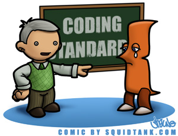

  During my years in middle school, my teacher often emphasized that one could see a person's character traits through their handwriting. This idea is based on scientific research where people's handwriting was studied on their personalities. For example, careful writing often indicates a person who values precision and puts effort into achieving satisfactory results.
	In the field of software engineering, Linus Torvalds, father of Linux, stated a similar idea when he remarked, “Talk is cheap. Show me the code.” Even though coding involves typing rather than handwriting, one can still gather information about a coder's personality by looking at the code. The style, structure, and formatting of code speaks volumes about the coder's professionalism and taste in this craft. Software engineering, like any other engineering discipline, has a set of rules to be followed, such as coding standards. These coding standards enforced to enhance readability and comprehensibility of software by fellow engineers, embody the essence of collaborative and disciplined software development. Adhering to these standards reminds me of learning a new language: you learn how to write letters by following “letter trace” guides. Initially, overwhelming, following these guidelines gradually transforms once crooked “letters” into nice “words” and then “sentences”, offering a sense of inner satisfaction and achievement.
	It would be really hard to follow the rules manually, so to facilitate compliance to coding standards, sophisticated tools such as IntellIJ and ESLint become demanded, especially for collaborative projects. I actually think that one of the best ways to learn a language is to enable code analysis tools such as ESLint, it will not only help you to develop a good taste but also make your code more efficient. 
	In conclusion, compliance to coding standards significantly eases the process of reading and debugging code, benefiting not only the original author but also other team members. It cultivates a culture of efficiency and coherence, like well-formed handwriting that aids effective communication.
