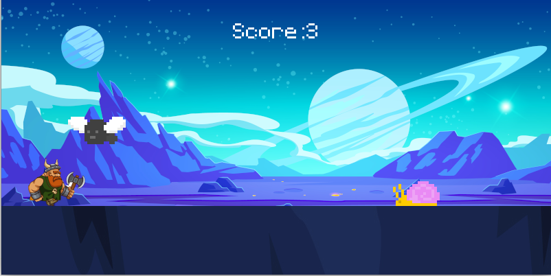

## Abstract
"Viking fighting giant flyes and snails somwhere in the Universe". This is my first game written in python, using pygame module.

## How does a game work?
A player gets a point every second, while he stays alive. Game ends once the character is touched by its enemies. A fundamental concept in game development is the game loop. This loop continually updates the game's logic and redraws the screen to create animation and interactivity. It typically includes events handling for user input and collision detection. Pygame provides tools for loading and displaying images and graphics. You can create sprites, load images, and move them on the screen. Sprites can represent characters, enemies, power-ups, or any other element in your game.

## What I learnt?
I learnt how to build simple 2D games using pygame.

Source: <a href="https://github.com/mikhail-shkaralevich/viking-game"><i class="large github icon "></i>mikhail-shkaralevich/viking-game</a>
