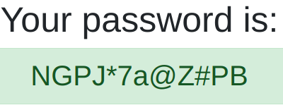
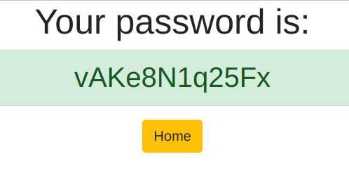

## Abstract
In the age of cyber threats, it's a good practice to have a strong unique password for each account. The idea behind this project was to automate password creation and make it easily accessible from all of the devices connected to my home network.

## Implementation process
To make the password generator easily accessible from all my devices, I decided to make it as a web-application and host it on my home server. I used Django for back end (which is definetely overkill) and HTML&CSS for front end. The code of the logic behind password generation:
<code>
def password(request):
    characters = list('abcdefghijklmnopqrstuvwxyz')

    if request.GET.get('uppercase'):
        characters.extend(list('ABCDEFGHIJKLMNOPQRSTUVWXYZ'))

    if request.GET.get('special'):
        characters.extend(list('!@#$%^&*'))

    if request.GET.get('numbers'):
        characters.extend(list('1234567890'))

    length = request.GET.get('length', 12)

    thepassword = ''
    for x in range(int(length)):
        thepassword += random.choice(characters)

    return render(request, 'generator/password.html', {'password':thepassword})
</code>

## What I learnt
It was my first web-app written in Django, so I learn more about the features of the framework. I also wanted to be able to access the app from any network, so I had to set up VPN on my home network, which was a good excercise to learn more about networking.

Source: <a href="https://github.com/mikhail-shkaralevich/django3_password_generator"><i class="large github icon "></i>mikhail-shkaralevich/password_generator</a>
